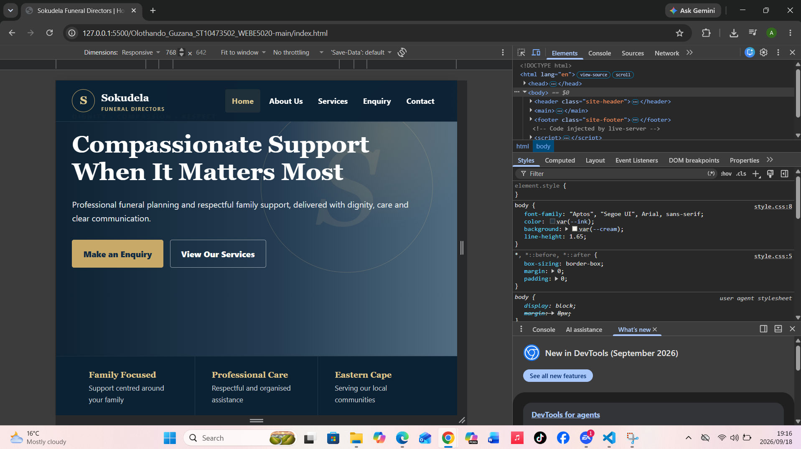
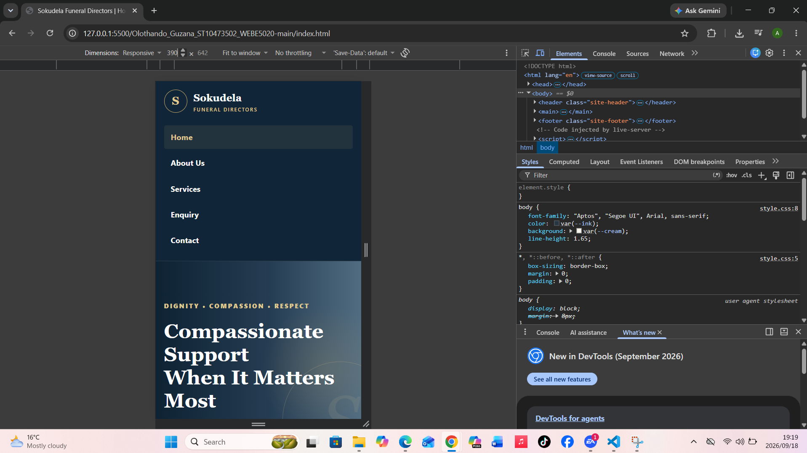
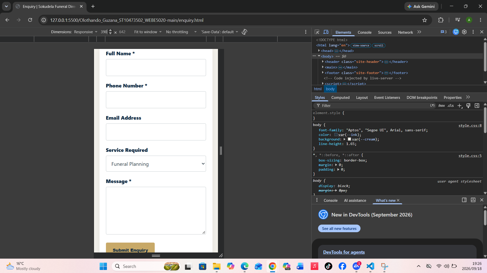
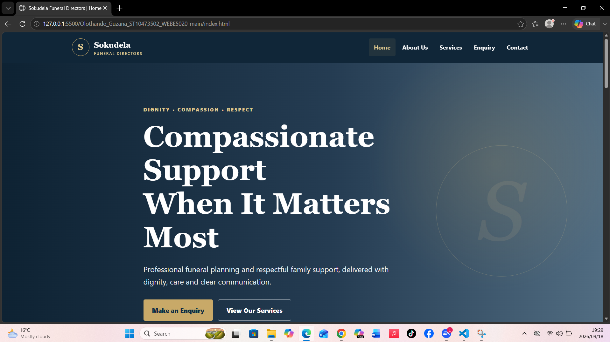

# Sokudela Funeral Directors Website

## Student Information
- Student: Olothando Guzana
- Student Number: ST10473502
- Module: WEBE5020
- Project: Sokudela Funeral Directors

## Project Overview
This repository contains a five-page responsive website prototype for Sokudela Funeral Directors. The project focuses on a respectful, professional user experience for families seeking funeral-service information.

## Website Goals
- Present Sokudela Funeral Directors professionally online.
- Make funeral-service information easy to understand.
- Provide clear enquiry and contact pathways.
- Support desktop, tablet and mobile users.
- Provide contact information for more than one proposed branch.

## Pages
- `index.html` — Home
- `about.html` — About Us
- `services.html` — Services
- `enquiry.html` — Enquiry
- `contact.html` — Contact

## Part 2 CSS and Responsive Design
Part 2 includes an external stylesheet, CSS reset, CSS custom properties, typography hierarchy, Flexbox navigation, CSS Grid layouts, responsive service cards, hover/focus/active states, responsive forms, desktop/tablet/mobile layouts, relative units, reduced-motion accessibility support, and a professional navy, cream and gold visual identity.

## Responsive Breakpoints
- Desktop: above 900px
- Tablet: 701px–900px
- Mobile: 700px and below

## Sitemap
Home → About Us / Services / Enquiry / Contact

## Changelog

### Part 1
- Created initial five-page HTML structure.
- Added shared navigation.
- Added service, organisation and contact content.
- Added enquiry and contact forms.

### Part 2
- Added full external responsive stylesheet.
- Added CSS reset and reusable design variables.
- Redesigned homepage with a professional hero section.
- Added Sokudela logo treatment.
- Added elegant service cards and sample testimonials.
- Added East London and Mdantsane branch sections.
- Added professional multi-column footer.
- Added Flexbox and CSS Grid layouts.
- Added hover, focus and active interaction states.
- Added tablet and mobile media queries.
- Improved typography, spacing, responsive forms and accessibility.
- Added a responsive `<picture>` element with `srcset` and `sizes` for image optimisation.
- Added small, medium and large original memorial image assets for responsive loading.
- Added `em` spacing alongside `rem` and percentage-based responsive units.
- Completed responsive testing at 768px tablet and 390px mobile widths.
- Tested the enquiry form at tablet and mobile widths.
- Completed cross-browser testing in Google Chrome and Microsoft Edge.
- Added testing screenshots to `testing-screenshots/`.

## Testing Evidence
Responsive testing was completed using Chrome Developer Tools and Microsoft Edge. The screenshots below document the tested layouts.

### Tablet Homepage — 768px
The homepage was tested at a 768px viewport. Navigation, hero content, buttons and layout remain readable and contained within the viewport.

### Mobile Homepage — 390px
The homepage was tested at a 390px viewport. The navigation changes to a vertical mobile layout and the hero content resizes for the smaller screen.

### Tablet Enquiry Form — 768px
The enquiry form was checked at tablet width to confirm that labels, input fields, the service selector and message area remain readable and correctly sized.

### Mobile Enquiry Form — 390px
The enquiry form was tested at 390px. Form controls fit within the mobile viewport without horizontal overflow.

### Cross-Browser Testing — Microsoft Edge
The homepage was opened in Microsoft Edge to check cross-browser presentation. The navigation, typography, hero section, buttons and overall styling displayed correctly.

### Functional Testing
The following checks were completed:
- Navigation opens the Home, About Us, Services, Enquiry and Contact pages.
- Responsive layouts were checked at tablet and mobile widths.
- Enquiry form controls remain readable on tablet and mobile.
- The responsive design changes appropriately at the defined breakpoints.
- The site was checked in Google Chrome and Microsoft Edge.

## Academic Content Notice
Some organisation history, branch information, contact information and testimonials are realistic fictional placeholders for this academic project. They must be verified and approved before real-world publication.

## References
GitHub Docs (2026) *GitHub documentation*. Available at: https://docs.github.com/ (Accessed: 18 September 2026).

MDN Web Docs (2026) *Responsive images*. Available at: https://developer.mozilla.org/en-US/docs/Learn_web_development/Core/Structuring_content/HTML_images (Accessed: 18 September 2026).

MDN Web Docs (2026) *Using media queries*. Available at: https://developer.mozilla.org/en-US/docs/Web/CSS/CSS_media_queries/Using_media_queries (Accessed: 18 September 2026).

Microsoft (2026) *Visual Studio Code documentation*. Available at: https://code.visualstudio.com/docs (Accessed: 18 September 2026).

All memorial illustration assets in `assets/images/` were created specifically for this academic website and do not use third-party photographs.
